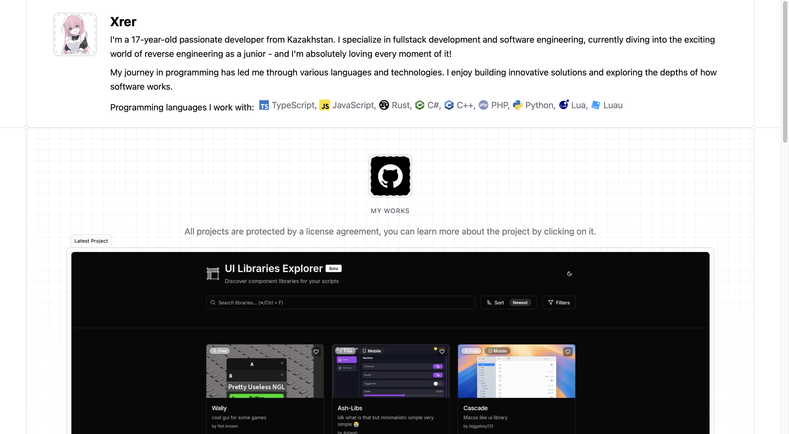

<picture>
  
</picture>

# Modern Portfolio Website

A sleek, modern portfolio website built with Astro, React, and Tailwind CSS. Features a configuration-driven approach for easy customization and maintenance.

## ✨ Features

- 🎨 **Modern UI/UX** - Clean, professional design with smooth animations
- 📱 **Fully Responsive** - Works seamlessly across all devices
- 🎯 **Configuration-Driven** - Update your portfolio without touching component code
- 🔍 **SEO Optimized** - Complete meta tags, Open Graph, Twitter Cards, and JSON-LD
- 🌙 **Dark Mode Ready** - Built-in theme support with next-themes
- 🚀 **Fast Performance** - Built on Astro for optimal loading speeds
- 📊 **GitHub Integration** - Automatically fetches and displays your repositories
- 🎥 **Rich Media Support** - Video previews, images, and interactive components
- ♿ **Accessible** - Built with Radix UI primitives for accessibility

## 🚀 Quick Start

### Prerequisites

- Node.js 18+
- npm, yarn, or pnpm (recommended)

### Installation

```bash
# Clone the repository
git clone <your-repo-url>
cd xrer.space

# Install dependencies
npm install

# Start development server
npm run dev
```

Visit `http://localhost:4321` to see your portfolio.

## 📝 Configuration

All portfolio content is managed through a single configuration file: `src/config/portfolio.ts`

### Update Personal Information

```typescript
personal: {
  name: "Your Name",
  age: 25,
  location: "Your Location",
  title: "Your Professional Title",
  bio: ["Your bio paragraphs..."],
  avatar: "/your-avatar.png",
  socialLinks: {
    github: "https://github.com/yourusername",
    linkedin: "https://linkedin.com/in/yourusername",
    twitter: "https://twitter.com/yourusername",
    email: "your.email@example.com"
  }
}
```

### Add Skills

```typescript
skills: [
  { name: "TypeScript", icon: "/icons/typescript.svg", category: "language" },
  { name: "React", icon: "/icons/react.svg", category: "framework" }
]
```

Place skill icons in `public/icons/` directory.

### Add Projects

```typescript
projects: [
  {
    id: "project-id",
    title: "Project Title",
    description: "Project description",
    url: "https://project-url.com",
    githubUrl: "https://github.com/user/repo",
    technologies: ["React", "TypeScript"],
    featured: true
  }
]
```

### Configure SEO

```typescript
seo: {
  title: "Your Name - Your Title",
  description: "Your professional description",
  keywords: ["Your Name", "Developer", "Your Skills"],
  siteUrl: "https://yourdomain.com",
  image: "/og-image.png"
}
```

For detailed configuration instructions, see [PORTFOLIO_CONFIG.md](./PORTFOLIO_CONFIG.md)

## 🛠️ Tech Stack

- **Framework**: [Astro 5.11](https://astro.build/) - Fast, content-focused web framework
- **UI Library**: [React 19](https://react.dev/) - Component-based UI library
- **Styling**: [Tailwind CSS 4.1](https://tailwindcss.com/) - Utility-first CSS framework
- **Components**: [Radix UI](https://www.radix-ui.com/) - Accessible component primitives
- **Icons**: [Lucide React](https://lucide.dev/) - Beautiful icon library
- **Animations**: [tw-animate-css](https://www.npmjs.com/package/tw-animate-css) - CSS animations for Tailwind
- **Forms**: [React Hook Form](https://react-hook-form.com/) + [Zod](https://zod.dev/) - Type-safe form validation
- **Theme**: [next-themes](https://github.com/pacocoursey/next-themes) - Dark mode support

## 📦 Project Structure

```
/
├── public/
│   ├── icons/              # Skill icons
│   ├── images/             # Project images
│   └── videos/             # Project video previews
├── src/
│   ├── components/
│   │   ├── containers/     # Section containers (about, projects, etc.)
│   │   ├── patters/        # Pattern components (grid, etc.)
│   │   ├── ui/             # Reusable UI components
│   │   ├── GitHubRepoCard.astro
│   │   └── ProjectCard.astro
│   ├── config/
│   │   └── portfolio.ts    # Main configuration file
│   ├── layouts/
│   │   └── Layout.astro    # Base layout
│   └── pages/
│       └── index.astro     # Home page
└── package.json
```

## 🎨 Customization

### Colors & Theme

Tailwind configuration supports custom color schemes. Edit your theme in the Tailwind config or use CSS variables for dynamic theming.

### Components

All components are modular and can be customized individually:
- `src/components/containers/` - Main section containers
- `src/components/ui/` - Reusable UI components
- `src/components/ProjectCard.astro` - Project display cards
- `src/components/GitHubRepoCard.astro` - GitHub repository cards

## 🔧 Available Scripts

```bash
# Development
npm run dev          # Start dev server at localhost:4321

# Production
npm run build        # Build for production
npm run preview      # Preview production build locally

# Astro CLI
npm run astro        # Run Astro CLI commands
```

## 🌐 Deployment

This portfolio can be deployed to any static hosting service:

### Vercel
```bash
# Install Vercel CLI
npm i -g vercel

# Deploy
vercel
```

### Netlify
```bash
# Install Netlify CLI
npm i -g netlify-cli

# Deploy
netlify deploy --prod
```

### GitHub Pages
```bash
# Build
npm run build

# Deploy dist/ folder to gh-pages branch
```

## 📄 License

This project is open source and available under the [MIT License](LICENSE).

## 🤝 Contributing

Contributions, issues, and feature requests are welcome! Feel free to check the issues page.

---

Built with ❤️ using Astro
